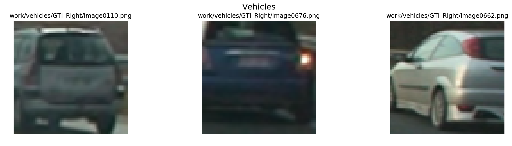
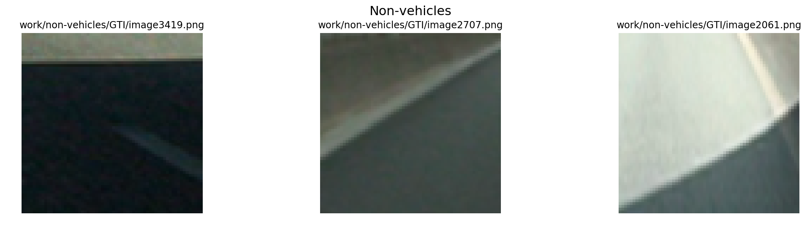
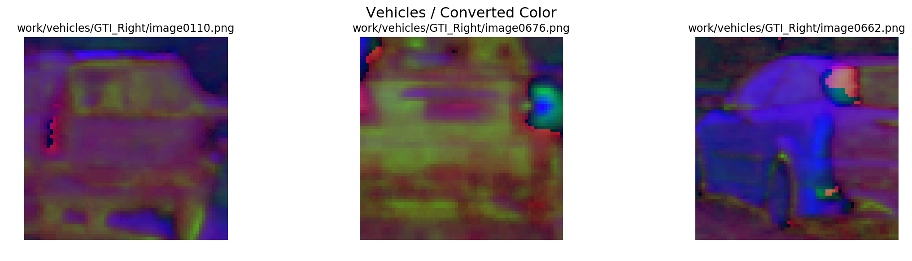
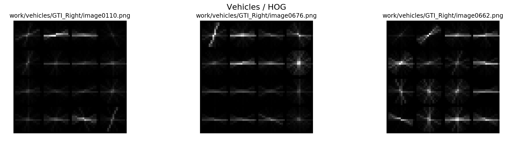
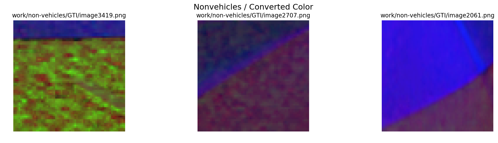
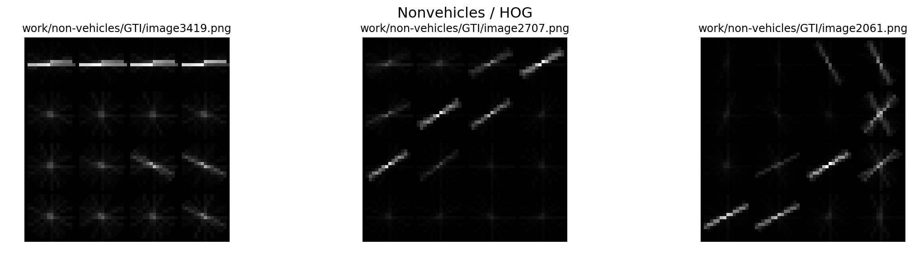
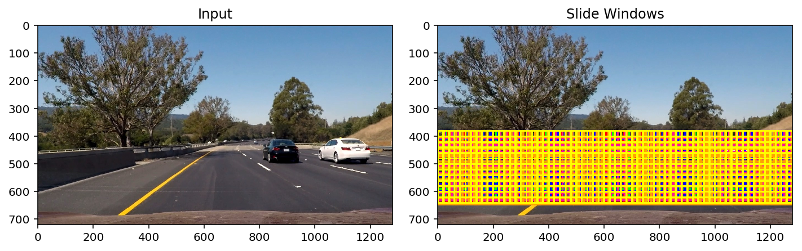
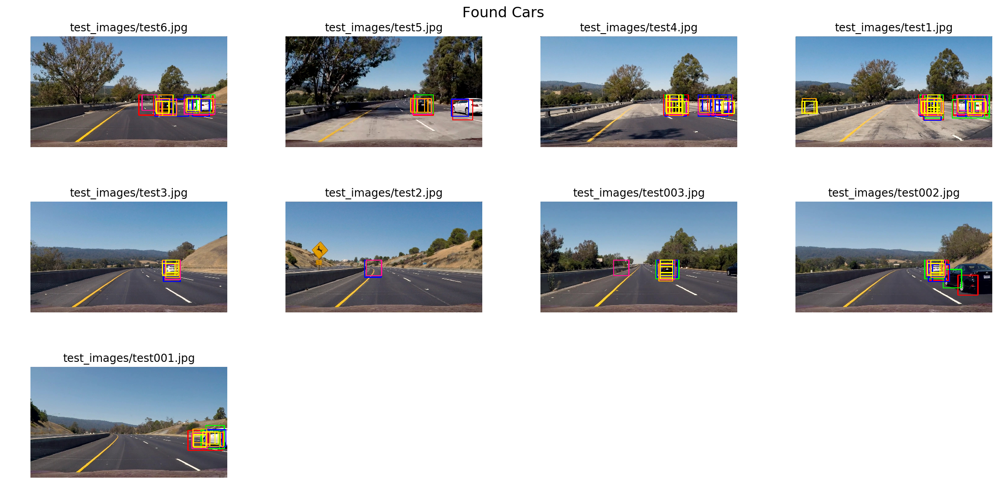
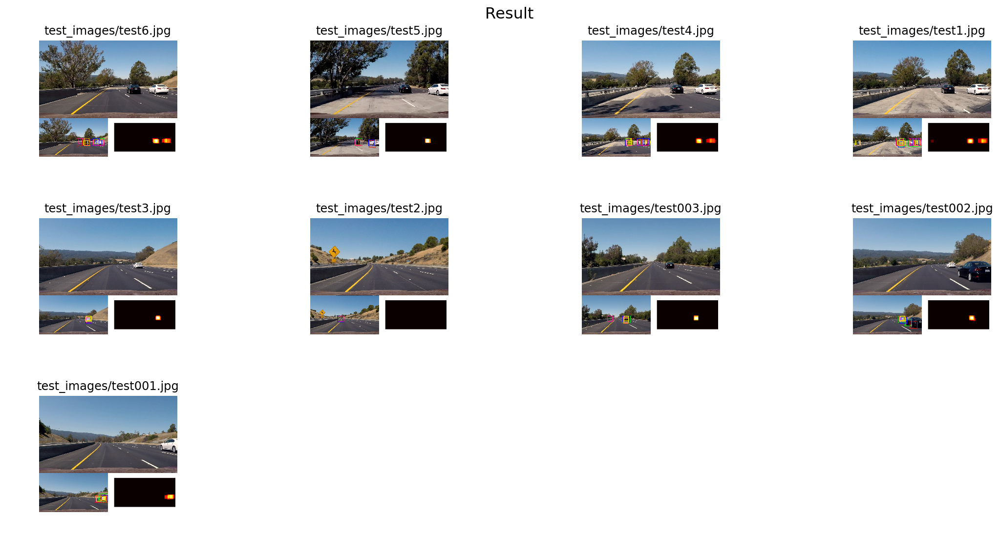

## Writeup Template
### You can use this file as a template for your writeup if you want to submit it as a markdown file, but feel free to use some other method and submit a pdf if you prefer.

---

**Vehicle Detection Project**

The goals / steps of this project are the following:

* Perform a Histogram of Oriented Gradients (HOG) feature extraction on a labeled training set of images and train a classifier Linear SVM classifier
* Optionally, you can also apply a color transform and append binned color features, as well as histograms of color, to your HOG feature vector. 
* Note: for those first two steps don't forget to normalize your features and randomize a selection for training and testing.
* Implement a sliding-window technique and use your trained classifier to search for vehicles in images.
* Run your pipeline on a video stream (start with the test_video.mp4 and later implement on full project_video.mp4) and create a heat map of recurring detections frame by frame to reject outliers and follow detected vehicles.
* Estimate a bounding box for vehicles detected.

## [Rubric](https://review.udacity.com/#!/rubrics/513/view) Points
### Here I will consider the rubric points individually and describe how I addressed each point in my implementation.  

---
### Writeup / README

#### 1. Provide a Writeup / README that includes all the rubric points and how you addressed each one.  You can submit your writeup as markdown or pdf.  [Here](https://github.com/udacity/CarND-Vehicle-Detection/blob/master/writeup_template.md) is a template writeup for this project you can use as a guide and a starting point.  

You're reading it!

### Histogram of Oriented Gradients (HOG)

#### 1. Explain how (and identify where in your code) you extracted HOG features from the training images.

The code for this step is contained in the 4 - 7 code cells of the IPython notebook `solution.ipynb`.

I started by reading in all the `vehicle` and `non-vehicle` images.  Here is an example of one of each of the `vehicle` and `non-vehicle` classes:





I then explored different color spaces and different `skimage.hog()` parameters (`orientations`, `pixels_per_cell`, and `cells_per_block`).  I grabbed random images from each of the two classes and displayed them to get a feel for what the `skimage.hog()` output looks like.

Here is an example using the `HSV` color space and HOG parameters of `orientations=32`, `pixels_per_cell=(16, 16)` and `cells_per_block=(2, 2)`:









#### 2. Explain how you settled on your final choice of HOG parameters.

I tried various combinations of parameters and I found that next configuration has less false positive on images and good car identification performance:

```python
color_space = "HSV"  # Can be RGB, HSV, LUV, HLS, YUV, YCrCb, LAB
orient = 32  # better performs in car classification together with pix_per_cell = 16
pix_per_cell = 16  # better performs in car classification together with orient = 32
cell_per_block = 2  # performance didn't change much so I left 2
hog_channel = "ALL"  # better performs in car classification than single channel
block_norm = "L2"  # better performs in car classification than L1
```

#### 3. Describe how (and identify where in your code) you trained a classifier using your selected HOG features (and color features if you used them).

I trained a linear SVM using only HOG features because when I was trying to identify a cars with spatial color binning and histogram color features I've got more false positives on video compare to just single HOG features.

### Sliding Window Search

#### 1. Describe how (and identify where in your code) you implemented a sliding window search.  How did you decide what scales to search and how much to overlap windows?

I decided to use next sliding window sizes all over the image and came up with this:

```python
slide_window_config = [
    {
        "top_y": 0.53, # coefficient used to get top side of ROI
        "bottom_y": 0.9, # coefficient used to get bottom side of ROI
        "xy_window": 130, # window size
        "color": (255, 0, 0)  # red - color used to draw a rectangle
    }, {
        "top_y": 0.53,
        "bottom_y": 0.9,
        "xy_window": 120,
        "color": (0, 255, 0)  # green
    }, {
        "top_y": 0.53,
        "bottom_y": 0.9,
        "xy_window": 110,
        "color": (0, 0, 255)  # blue
    }, {
        "top_y": 0.53,
        "bottom_y": 0.9,
        "xy_window": 100,
        "color": (255, 20, 147)  # deep pink
    }, {
        "top_y": 0.53,
        "bottom_y": 0.9,
        "xy_window": 90,
        "color": (255, 165, 0)  # orange
    }, {
        "top_y": 0.53,
        "bottom_y": 0.9,
        "xy_window": 80,
        "color": (255, 255, 0)  # yellow
    }
]
```



#### 2. Show some examples of test images to demonstrate how your pipeline is working.  What did you do to optimize the performance of your classifier?

I searched using HSV 3-channel HOG features in the feature vector, which provided a nice result. Here are some example images:



---

### Video Implementation

#### 1. Provide a link to your final video output.  Your pipeline should perform reasonably well on the entire project video (somewhat wobbly or unstable bounding boxes are ok as long as you are identifying the vehicles most of the time with minimal false positives.)

Here's a [link to my video result](output_images/out_project_video.mp4)


#### 2. Describe how (and identify where in your code) you implemented some kind of filter for false positives and some method for combining overlapping bounding boxes.

I recorded the positions of positive detections in each frame of the video.  From the positive detections I created a heatmap and then thresholded that map to identify vehicle positions. I then used `scipy.ndimage.measurements.label()` to identify individual blobs in the heatmap. I then assumed each blob corresponded to a vehicle. I constructed bounding boxes to cover the area of each blob detected.  

Here's an example result showing the heatmap from a series of frames of video, the result of `scipy.ndimage.measurements.label()` and the bounding boxes then overlaid on the last frame of video:

### Here are some frames and their corresponding heatmaps:




---

### Discussion

#### 1. Briefly discuss any problems / issues you faced in your implementation of this project.  Where will your pipeline likely fail?  What could you do to make it more robust?

To make bounding boxes more stable on the video I decided to use last found boxes together with 5 boxes from previous frames and group them all together. 
Also I found that with YCrCb color space I had better performance for the black cars but worse for the white one. In HSV situation is opposite: better for white cars and worse for black one, which does make sense to me, because in previous project I was playing around different color spaces and saw that LAB, HSV better works with bright colors.
So first thing I would try to improve in car detection is to combine boxes generated using different color spaces, such as YCrCb and HSV.
Next thing to improve is to tune sliding windows sizes to speedup frame processing.
And finally run frame processing in parallel.
While I was working on this project I discovered that there are other deep learning solutions for car detection such as SSD and YOLO. So I think it is worth to try them too.
